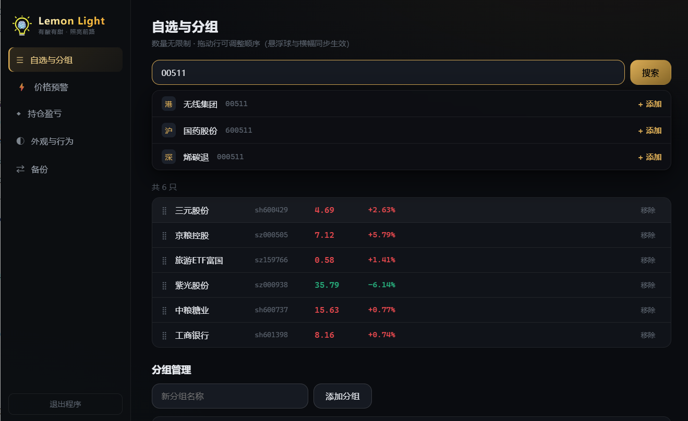
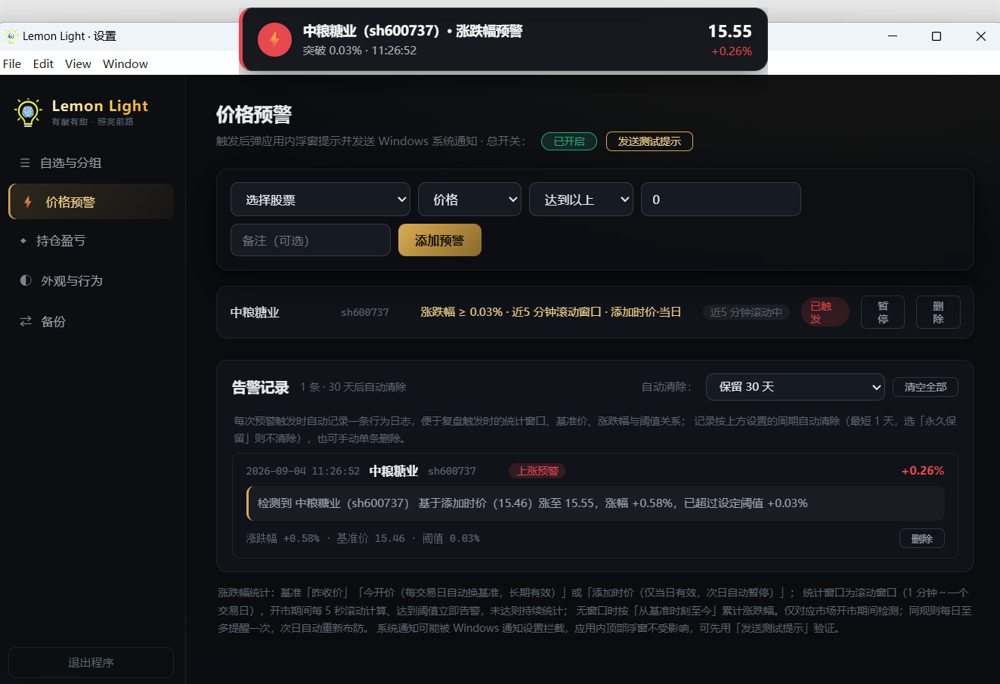
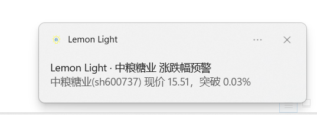
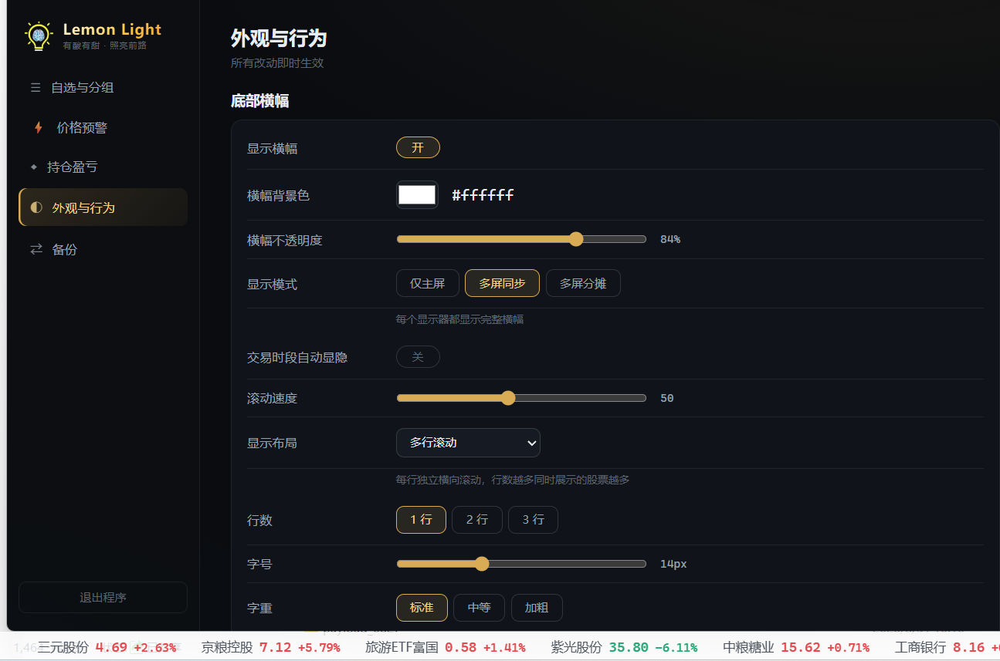
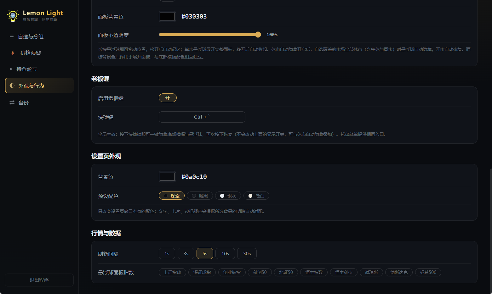
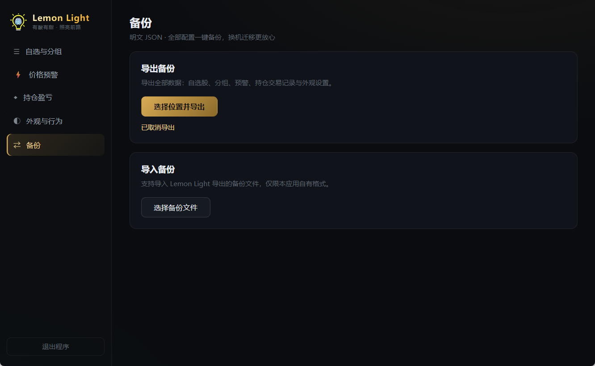

 

# Lemon Light · 柠檬灯

**有酸有甜，照亮前路** —— flag 你 happy 我不 happy，有人快乐就有人哭泣。

A 股 / 港股 / 美股 行情桌面悬浮盯盘工具（悬浮球 + 底部横幅）

Windows 10/11 · x64 · 本地私有 · 无账号无后端

***

## 目录

- [项目简介](#项目简介)

- [功能特性](#功能特性)

- [支持的代码格式与行情源](#支持的代码格式与行情源)

- [技术栈与架构](#技术栈与架构)

- [目录结构](#目录结构)

- [环境要求](#环境要求)

- [开发与构建](#开发与构建)

- [数据存储与备份](#数据存储与备份)

- [常见问题 FAQ](#常见问题-faq)

- [License](#license)

***

## 项目简介

Lemon Light（柠檬灯）是一个把"股票盯盘"做成低打扰windows桌面小工具的应用：

- **悬浮球**：常驻屏幕角落的行情小球，显示当前自选股的实时价格与涨跌；

- **底部横幅**：像电视行情条一样贴在桌面底部（可多屏同步），一眼扫完所有自选与指数；

- 

- **本地优先**：所有自选、分组、预警、持仓数据只保存在本机 JSON 文件里，无账号、无后端、无订阅，
  一键导出为明文备份，换机迁移非常方便。

> 行情数据来自第三方公开接口，仅供参考，不构成任何投资建议。

***

## 功能特性

### 悬浮球（Floating Ball）

- 置顶小圆球，实时显示当前关注品种的**名称 / 现价 / 涨跌额 / 涨跌幅**；

- **鼠标穿透**：开启后不会挡住你点击桌面上的其他窗口；

- **长按拖动**：按住约 0.4 秒后随意拖动到屏幕任意位置，位置自动记忆；

- 单击展开行情面板：

  - 自选股逐条行情 + 分组快捷切换

  - 常用指数一览（上证 / 深成 / 创业板 / 恒指 / 纳斯达克等）

  - 持仓总市值与**当日 / 持仓盈亏**汇总

- 无自选时圆球内显示应用 Logo，点击即可展开面板快速添加自选。

- **休市自动隐藏**：自选覆盖市场全部休市（含午休与周末）时悬浮球自动隐藏；每日开盘前 5 分钟提前显示以便观察竞价/开盘价，收盘后 30 分钟内保持显示尾盘固定价，之后才自动隐藏。

### 底部横幅（Bottom Banner）

- 贴底显示的自选股 + 指数滚动行情条；

- **多屏同步**：每个显示器上都会生成一条横幅，内容与设置实时同步；

- **三种布局**：`rows`（分行）、`stacked`（堆叠）、`dual`（单行双子段）自由切换；

- 可调：**行数（1–3 行）**、字号（10–22px）、字重、字体（微软雅黑 / 黑体 / 宋体 / 楷体等系统字体）；

- 可调滚动速度、是否跟随主要指数、是否自动隐藏；

- **长按拖动定位**：横幅可被长按拖到屏幕任意位置固定（支持多屏各自记忆位置）；

- 条目可拖拽排序；双击横幅左侧把手可一键回到屏幕底部默认位置。

### 自选股与分组（Watchlist & Groups）

> 界面预览：设置页「自选与分组」——联想搜索添加、自定义分组名与配色、组内排序、常用指数快捷添加。



- 支持按 **中文名 / 拼音 / 代码 / 市场标签** 联想搜索添加；

- 沪深京、港股、美股、指数混排；

- 多分组管理，自定义分组名与颜色，组内顺序可拖拽调整；

- 内置常用指数一键添加。

### 价格预警（Alerts）

> 界面预览：设置页「价格预警」——上方为规则添加与每行实时状态，下方为告警行为日志与保留清理。





- 两种维度：**触发价**、**涨跌幅**；

- 两种方向：向上突破（≥）、向下跌破（≤）；

- 涨跌幅统计**基准**三选一：

  - **昨收价（传统）**：对照昨收计算，长期有效；

  - **今开价（每日基准）**：每个交易日自动以当天开盘价为基准，长期有效；

  - **添加时价（当日有效）**：以添加规则那一刻的现价为基准，仅当日有效，次日自动暂停布防；

- 涨跌幅规则可设置**滚动统计窗口**（1 分钟 ～ 一个交易日 240 分钟）：开市期间每 5 秒滚动计算，
  窗口内涨跌幅一旦达到阈值**立即告警**；不设窗口则按"从基准时刻至今"累计统计；

- 命中后弹出**应用内透明浮窗**并发送 **Windows 系统通知**（系统通知可能被 Windows 通知设置拦截，
  浮窗不受影响，可先用「发送测试提示」按钮验证）；同一规则每日至多提醒一次，次日自动重新布防；
  非交易时段自动停止检查，开盘前自动恢复轮询；支持全局总开关，每行实时显示监控中 / 已满足 / 已暂停状态。

- **告警行为日志**：每次触发自动记录一条日志，内含完整"行为分析"文本——统计时间窗口（起止时间）、
  基准价 → 现价的变化路径、涨跌幅与设定阈值的对比，便于复盘。例如：

  > `检测到 中粮糖业（sz000938）在时间窗口5分钟（2026-09-04 10:00 至 2026-09-04 10:05）内，价格由 0.85 涨至 0.93，涨幅 +9.41%，已超过设定阈值 +1.30%`

- 日志支持**手动删除**（单条删除 / 一键清空），并支持**自定义自动清除周期**：最短 1 天、最长**永久保留**，
  到期由主进程自动清理。

### 持仓盈亏（Holdings）

- 记录买卖流水，自动计算持仓成本、市值、浮动盈亏与已实现盈亏；

- 当日盈亏汇总可直接在悬浮球面板看到；

- 支持归档历史交易。

### 外观与行为（Appearance）

> 界面预览：设置页「外观与行为」——横幅自定义（布局 / 行数 / 字号 / 颜色 / 透明度）与老板键配置。





- 底部横幅：背景色、不透明度、布局/行数/字号/字重/字体/滚动速度、交易时段自动显隐（每日开盘前 5 分钟提前显示、收盘后 30 分钟内保持显示尾盘价）、自定义位置记忆；

- 悬浮球：展开面板背景色与不透明度、休市自动隐藏（含午休与周末；开盘前 5 分钟提前显示捕捉竞价/开盘价、收盘后 30 分钟内保持显示尾盘价）；

- 老板键：全局快捷键一键隐藏/恢复底部横幅与悬浮球（默认 Ctrl+Shift+B，支持 - + 等符号组合）；

- 设置页配色：可自定义背景色并预设多种配色，文字/卡片颜色按明暗自动适配；

- 刷新频率可调（默认 5 秒）。

### 备份与迁移（Backup）

> 界面预览：设置页「备份迁移」——导出备份文件、导入时按类别勾选恢复。



- 明文 JSON，一键导出 / 导入，字段完整覆盖自选、分组、预警、持仓与设置；

- 自有格式（见下文 [数据存储与备份](#数据存储与备份)），简单可读、可手工编辑；

- 数据全部在本地，导出文件即是完整的个人配置。

### 其他

- 系统托盘常驻：快捷开关悬浮球 / 横幅、打开设置、退出；

- 单实例运行，重复启动会自动聚焦设置窗口；

- 多显示器插拔自动增删横幅，位置独立记忆。

***

## 支持的代码格式与行情源

支持三类市场，代码统一使用带市场前缀的内部格式：

| 市场  | 内部格式               | 示例                               | 说明                     |
| --- | ------------------ | -------------------------------- | ---------------------- |
| A 股 | `sh/sz/bj` + 6 位代码 | `sh600519`、`sz000001`、`bj899050` | 输入 6 位纯数字会自动按首位识别沪/深/北 |
| 港股  | `hk` + 5 位代码       | `hk00700`                        | 输入 5 位纯数字自动补 `hk`      |
| 美股  | `us` + 代码          | `usAAPL`                         | 输入字母代码自动补 `us`         |

内置常用指数：上证指数、深证成指、创业板指、科创 50、北证 50、恒生指数、恒生科技、道琼斯、纳斯达克、标普 500。

行情获取逻辑：

1. **腾讯行情**为主批量接口（支持沪深京 / 港股 / 部分指数批量查询）；
2. **东方财富**作为逐只兜底 / 补充来源（对部分指数与海外代码做二次解析）；
3. 名字对照使用双方接口返回的官方名称，并做常见转义清洗，避免乱码；
4. 轮询引擎带交易时段调度：休市期间停止请求，按"下一开盘时间"自动恢复；
5. 搜索联想支持腾讯、东方财富双源。

***

## 技术栈与架构

| 层    | 技术                                     |
| ---- | -------------------------------------- |
| 桌面框架 | Electron 44                            |
| 构建   | electron-vite 5（多入口，主/预加载/渲染三套产物）      |
| UI   | Vue 3 `<script setup>` + Pinia         |
| 语言   | TypeScript（strict），全仓无 JavaScript 业务代码 |
| 打包   | electron-builder（NSIS 安装版 / x64）       |

窗口模型：应用共运行三类窗口——

```
Electron 主进程 (electron/main)
├─ FloatingBallWindow  透明无边框置顶悬浮球窗口
├─ BannerWindow × N    每个显示器一个透明底部横幅窗口
├─ SettingsWindow      设置窗口（自选/预警/持仓/外观/备份）
├─ QuoteService        轮询 + 交易时段调度 + 预警引擎
├─ Tray                系统托盘
└─ Storage             单文件 JSON 本地存储 + 完整快照广播
        │
        ▼
preload (contextBridge)  →  window.lemonLight（受控 IPC API）
        │
        ▼
renderer (src/)
├─ floating-ball   悬浮球与展开面板
├─ bottom-banner   底部横幅（三种布局）
└─ settings        设置界面（五个 Tab）
```

设计要点：

- 三个渲染窗口之间**不直接通信**，所有状态统一走主进程：主进程持有数据库唯一实例，
  任何变更后向所有窗口广播**完整 DB 快照**（`db:changed`），窗口内 Pinia store 整体刷新，
  保证"改一处、处处同步"；

- 透明 / 无边框 / 置顶 / 鼠标穿透均由主进程控制，渲染层只负责绘制与交互；

- 自定义"长按拖动"协议：渲染层上报指针偏移，主进程负责移动窗口边界并持久化位置；

- 备份导入导出仅接受自有 `lemon-light` 格式，不做历史版本兼容。

***

## 目录结构

```
lemon-light (facai-desktop)
├─ electron/
│  ├─ main/                主进程
│  │  ├─ index.ts          生命周期 / IPC / 窗口调度 / 通知
│  │  ├─ windows.ts        悬浮球、横幅窗口与拖动协议
│  │  ├─ backup.ts         备份导入导出（自有格式）
│  │  └─ tray.ts           系统托盘
│  ├─ shared/              主进程与渲染进程共享的纯逻辑（不进 bundle）
│  │  ├─ quote-service.ts  行情轮询 + 交易时段调度 + 预警
│  │  ├─ sources/          腾讯 / 东方财富数据源
│  │  ├─ symbol.ts         市场识别 / 代码归一化 / 指数表
│  │  ├─ storage.ts        本地 JSON 存储与快照广播
│  │  ├─ defaults.ts       默认配置与深合并
│  │  └─ types.ts          Database / Quote / Settings 等类型
│  └─ preload/
│     └─ index.ts          contextBridge 暴露 window.lemonLight
├─ src/
│  ├─ floating-ball/       悬浮球渲染窗口
│  ├─ bottom-banner/       底部横幅渲染窗口
│  ├─ settings/            设置窗口（Watchlist / Alerts / Holdings / Appearance / Backup）
│  └─ shared/              渲染层共享（stores / 组件 / 样式 / bridge）
├─ resources/
│  ├─ logo.png             灯柠 Logo 源图（360×360）
│  ├─ icon.png             生成的 512×512 应用图标
│  └─ tray.png             生成的 32×32 托盘图标
├─ img/
│  └─ *.png                各功能界面截图（README 配图）
├─ scripts/
│  └─ gen-icon.mjs         纯 Node 从 logo.png 解码缩放生成图标（无第三方依赖）
├─ electron.vite.config.ts
├─ package.json
├─ LICENSE
└─ README.md
```

***

## 环境要求

- Windows 10 / 11（x64）

- Node.js 20 或更高（建议 Node.js LTS）

- npm 10+

> 项目当前仅面向 Windows 打包发布；源码层面无平台相关 API 限制，
> macOS / Linux 需要按 Electron 规范补充对应打包与窗口参数后才可完整工作。

***

## 开发与构建

```bash
# 安装依赖
npm install

# 开发模式（热更新，启动悬浮球/横幅/设置窗口）
npm run dev

# 类型检查
npm run typecheck

# 生产构建（输出到 out/）
npm run build

# 预览构建产物
npm run start

# 打 Windows 安装包（输出到 dist/，NSIS 安装版）
npm run pack

# 从 resources/logo.png 重新生成 icon.png / tray.png
npm run icon
```

打包产物说明（执行 `npm run pack` 后生成于 `dist/`）：

- `dist/Lemon Light Setup 1.0.1.exe` —— **NSIS 安装版**：可自定义安装目录、创建桌面快捷方式；

- `dist/LemonLight-1.0.1-portable.exe` —— **单文件便携版（无需安装）**：双击直接运行，
  数据自动存放在 exe 同级的 `LemonLightData/` 目录，拷贝整个目录即可整机迁移；

- `dist/win-unpacked/LemonLight.exe` —— 解包目录中的绿色可执行文件（供调试，非单文件）。

> 未签名应用的首次启动会触发 Windows SmartScreen 提示，
> 点击"更多信息 → 仍要运行"即可，程序本身不含任何联网上报与遥测。

***

## 数据存储与备份

### 本地数据文件

默认存放在 Electron 的 `userData` 目录：

```
%APPDATA%\Lemon Light\lemon-light-db.json
```

> 开发者可通过环境变量 `LEMON_LIGHT_USER_DATA=<目录>` 覆盖 `userData` 路径。

便携版（`LemonLight-*-portable.exe`）例外：单文件 exe 运行时会自动把数据放在
**exe 同级目录的** **`LemonLightData/`** **文件夹**中（`PORTABLE_EXECUTABLE_DIR`），
所以把便携版 exe 拷到哪里，数据就跟着走到哪里；如需强制改位置，仍可用上面的环境变量。

数据文件为单个 JSON，结构即完整数据库：

```jsonc
{
  "watchlist": ["sh600519", "usAAPL"],
  "groups": [{ "id": "g1", "name": "白酒", "color": "#d9ab55", "symbols": ["sh600519"] }],
  "alerts": [
    { "id": "a1", "symbol": "sh600519", "kind": "price", "direction": "gte", "threshold": 1700, "enabled": true },
    { "id": "a2", "symbol": "sz000938", "kind": "changePercent", "direction": "gte", "threshold": 1.3, "enabled": true, "baseline": "open", "windowMin": 5, "triggered": false, "firedAt": "2026-09-04" }
  ],
  "alertLogs": [
    { "id": "l1", "alertId": "a2", "symbol": "sz000938", "name": "中粮糖业", "kind": "changePercent", "direction": "gte", "threshold": 1.3, "firedAt": 1725422700000, "price": 0.93, "changePercent": 9.41, "value": 9.41, "refPrice": 0.85, "behaviorText": "检测到 中粮糖业（sz000938）在时间窗口5分钟（2026-09-04 10:00 至 2026-09-04 10:05）内，价格由 0.85 涨至 0.93，涨幅 +9.41%，已超过设定阈值 +1.30%" }
  ],
  "holdings": { "version": 2, "trades": [], "archives": [] },
  "settings": {
    "refreshIntervalMs": 5000,
    "alertsEnabled": true,
    "alertLogRetentionDays": 30,          // 0 = 永久保留
    "floatingBall": {},
    "bottomBanner": {},
    "bannerAppearance": {},               // 横幅配色
    "ballPanelAppearance": {},            // 悬浮球面板配色
    "settingsAppearance": {}              // 设置页配色
  }
}
```

### 备份文件（导入 / 导出）

备份是同样结构的明文 JSON，顶部带格式标记：

```jsonc
{
  "app": "lemon-light",          // 格式标识（仅识别该值）
  "version": "1.0.0",
  "exportedAt": "2026-09-03T00:00:00.000Z",
  "data": {
    "watchlist": [],
    "groups": [],
    "alerts": [],
    "holdings": { "version": 2, "trades": [], "archives": [] },
    "settings": {}
  }
}
```

- 只接受 `app === "lemon-light"` 的自有新格式；

- 导入时可按类别勾选（自选 / 分组 / 预警 / 持仓 / 设置），未勾选项保持现状；

- 文件可在多台电脑间迁移，也能手工用文本编辑器增删条目后导回。

***

## 常见问题 FAQ

**Q0：可以不安装，直接双击单个 exe 使用吗？**
可以。发布包里的 `LemonLight-*-portable.exe` 就是免安装单文件版：双击即运行，无需安装程序。
首次启动会把运行时解压到系统临时目录（约 2–5 秒，属正常现象）；数据与配置保存在 exe 同级
的 `LemonLightData/` 目录，方便放进 U 盘 / 网盘随取随用。注意不要放在只读目录中运行。

**Q1：悬浮球 / 横幅怎么移动？**
长按（按住约 0.4 秒）后拖动。悬浮球松开即停在当前位置；横幅可通过"外观与行为"里的
位置记忆管理，双击横幅顶部抓手区域可复位到底部。

**Q2：悬浮球或横幅在某些环境下显示有黑色方块 / 不透明残留？**
透明无边框窗口依赖系统合成。常见于：远程桌面（RDP）、部分虚拟机显卡、旧驱动或高 DPI 缩放组合。
建议：更新显卡驱动、避免经 RDP 全屏运行、关闭"窗口阴影"类第三方美化工具。

**Q3：为什么休市时行情不刷新 / 数字一直不变？**
轮询引擎内置交易时段调度：非交易时段停止请求，待下一开盘自动恢复，避免无意义请求与额度浪费。

**Q4：添加自选后没有立即出现？**
自选/指数变更会触发主进程立即拉取并广播快照，正常情况下 1–2 秒内所有窗口同步。
若网络不可用，会显示 `--` 占位并在恢复后自动补齐。

**Q5：程序提示 SmartScreen"未知发布者"？**
应用未购买商业代码签名证书，属正常现象。点"更多信息 → 仍要运行"即可。

**Q6：数据会联网上传吗？**
不会。仅向腾讯 / 东方财富的行情接口请求行情数据；自选、持仓、配置等全部保存在本机，无任何遥测。

***

## License

[LICENSE](./LICENSE) —— MIT License

Copyright (c) 2026 Happy0717

基于 MIT License 开源：可自由使用、修改、分发与商用，需保留版权声明。
软件按现状提供，行情数据仅供参考，不构成任何投资建议。
